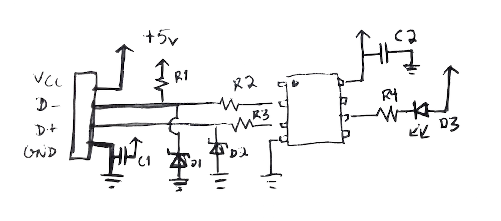

# Olark Observer Hardware
USB Vendor class device implementation using V-USB on the ATtiny85.

To accommodate a common-cathod RGB LED with PWM for each RGB channel, the following schematic should be adjusted as follows:
USB D- to PB2, D+ to PB3, common cathode RGB LED with red to PB4, green to PB0, and blue to PB1

- R1 1.5kOhm
- R2,R3 68ohm
- C1 10uF
- C2 .1uF
- D1,D2 3.3V zener diode (0.5W max!)
- R4 330ohm
- D3 LED
